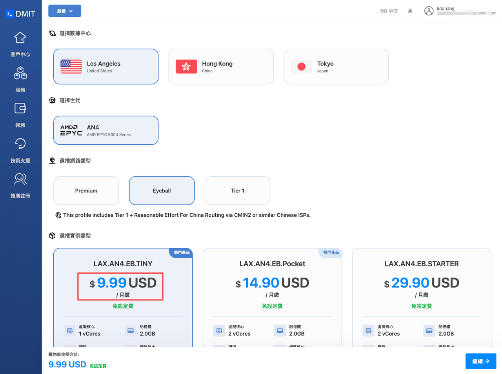
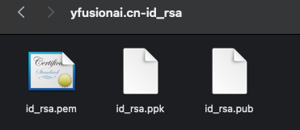
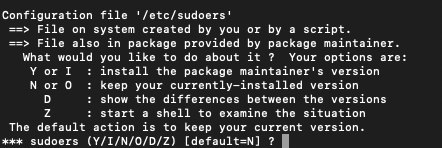
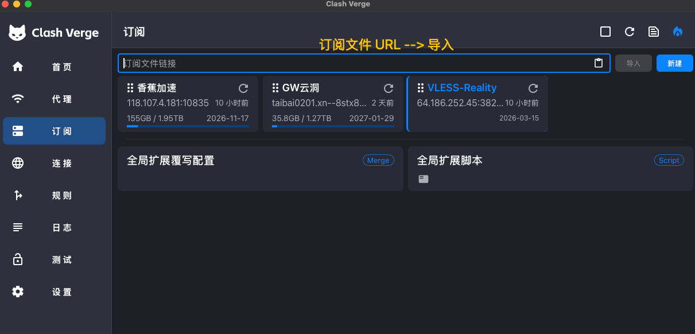

# 用干净 IP 访问 Claude：VPS + VPN + Clash 完整配置教程

> ⚠️ **重要说明**
>
> 本教程的目标是获得一个**相对干净的海外 IP**，降低因 IP 污染被封号的概率。
> **它不能保证彻底解决 Claude 封号问题。** 封号原因是多方面的（账号行为、支付方式、地区限制等），IP 只是其中一个因素。
>
> 请在充分了解上述前提后，再决定是否投入时间和金钱进行配置。

## 适用人群

本教程适合：

- 怀疑因 IP 污染导致 Claude / ChatGPT 访问异常或封号
- 需要一个干净、稳定的海外 IP 用于 AI 工具访问
- **Mac 用户**（Windows 用户 SSH 工具略有不同，其余步骤一致）

**预计费用：** $9.9 / 月（VPS）

---

## 目录

1. [整体思路](#整体思路)
2. [第一步：购买 VPS 服务器](#第一步购买-vps-服务器)
3. [第二步：用 SSH 连接 VPS 服务器](#第二步用-ssh-连接-vps-服务器)
4. [第三步：在 VPS 上安装 VPN 服务](#第三步在-vps-上安装-vpn-服务)
5. [第四步：安装 Clash 并导入订阅](#第四步安装-clash-并导入订阅)
6. [第五步：验证配置是否成功](#第五步验证配置是否成功)

---

## 整体思路

1. 购买海外 **VPS** 云服务器（推荐 [DMIT](https://www.dmit.io/)）
2. 用 **SSH** 连接 VPS 服务器
3. 在 VPS 上搭建 **VPN 服务**（使用 [v2ray-agent](https://github.com/mack-a/v2ray-agent)）
4. 把生成的订阅链接导入本地 **Clash**，开启 TUN 模式

> 想了解这套方案的原理？→ [为什么要在 VPS 上配置 VPN 服务？](docs/why-vps-vpn.md)

---

## 第一步：购买 VPS 服务器

推荐两个相对靠谱的 VPS 服务商：

- [DMIT](https://www.dmit.io/aff.php?aff=19116)（本教程以此为例）
- [VMiss](https://app.vmiss.com/aff.php?aff=4666)

注册 DMIT 无需手机号，直接用 Gmail 邮箱即可。



根据你的本地网络选择「网络类型」。

DMIT 有三条产品线，按优化等级递进：

| 产品线 | 线路优化 | 适合人群 | 说明 |
|--------|---------|---------|------|
| **Premium** | CN2 GIA，有 SLA 保障 | 电信用户、对稳定性要求高 | 最贵，最稳，有服务等级协议 |
| **Eyeball** | AS9929 / CMIN2，尽力优化 | 移动 / 联通用户 | 性价比优选，本教程选此档 |
| **Tier** | 国际标准路由，无中国优化 | 非中国用户 / 纯预算方案 | 最便宜，国内访问体验差 |

「实例类型」选 $9.9/月，先买 1 个月体验。

购买完成后，在控制台可以看到服务器的 **IPv4** 和 **IPv6** 地址。

---

### ✅ 先查 IP 质量

买完先别急着配置，先检测这个 IP 是否干净。

**方法一（网页版，快速）**

访问 [meowvps.com/tools/ip-check](https://meowvps.com/tools/ip-check/)，输入服务器 IPv4 地址。

> 想了解 IPv4 与 IPv6 的区别？→ [IPv4 和 IPv6 的区别](docs/ipv4-vs-ipv6.md)

**方法二（服务器端，更全面）⭐**

SSH 登录服务器后（下一步会讲如何登录），执行：

```bash
bash <(curl -Ls https://IP.Check.Place) -I
```

检测内容包括：IP 风险评分、端口开放状态、流媒体解锁情况。

💡 如果 IP 质量差，可以在 DMIT 提交工单申请换 IP；或在 3 天内、流量未超 3 GB 时申请退款。

---

## 第二步：用 SSH 连接 VPS 服务器

> **SSH** 是一种安全的远程连接协议，让你在本地终端操作远程服务器。

### Mac 操作步骤

1. 在 DMIT 控制台点击 **Download**，下载 PEM 私钥文件

   

2. 把私钥文件移动到 SSH 目录（把 `你下载的文件夹名` 替换为实际文件夹名称）：

   ```bash
   mv ~/Downloads/你下载的文件夹名/id_rsa.pem ~/.ssh/
   ```

3. **修改文件权限**（必做，否则 SSH 会报错拒绝连接）：

   ```bash
   chmod 600 ~/.ssh/id_rsa.pem
   ```

4. 连接服务器（把 `你的服务器IP` 替换为实际 IPv4 地址）：

   ```bash
   ssh -i ~/.ssh/id_rsa.pem root@你的服务器IP
   ```

5. 首次连接会出现确认提示，输入 `yes` 回车：

   ```
   Are you sure you want to continue connecting (yes/no/[fingerprint])?
   ```

> **Windows 用户**：下载 `.ppk` 格式的私钥，使用 [MobaXterm](https://mobaxterm.mobatek.net/)（免费推荐）或 Xshell 连接。

---

## 第三步：在 VPS 上安装 VPN 服务

使用开源项目 [v2ray-agent](https://github.com/mack-a/v2ray-agent)，一键脚本，无需手动配置。

**推荐方案：Xray + VLESS Reality（无域名版）**

| | **VLESS Reality** ✅ 推荐 | Hysteria2 |
|--|--|--|
| **稳定性** | 最稳，最适合防封 | 很快，个别环境略逊 |
| **速度** | 快 | **极快** |
| **抗封锁** | 最强（伪装正常 HTTPS 流量） | 强，不如 Reality |
| **适合场景** | 日常访问、防封首选 | 看视频、下载大文件 |

### 1. 安装基础环境

SSH 登录 VPS 后执行：

```bash
apt update && apt install -y wget curl sudo
```

### 2. 安装 v2ray-agent

```bash
wget -P /root -N --no-check-certificate "https://raw.githubusercontent.com/mack-a/v2ray-agent/master/install.sh" && chmod 700 /root/install.sh && /root/install.sh
```

脚本启动后，遇到 sudoers 相关提示选 **`N`**。



### 3. 选择协议

安装完成后，在菜单里选择：**Xray 内核 → VLESS Reality（无域名版）**

详细操作参考 [一键无域名版 Reality 安装教程](https://www.v2ray-agent.com/archives/1708584312877)

> 🚨 **遇到 SSH 连接反复中断？** → [解决 SSH 终端连接 VPS 反复中断的问题](docs/fix-ssh-disconnect.md)

### 4. 获取订阅链接

安装完成后，执行以下命令：

```bash
vasma
```

依次选择 `7` → `2` → 一路回车，得到 **clashMeta 订阅链接**：

```
url: http://你的服务器IP:端口/s/clashMetaProfiles/xxxxxxxxxxxxxxxx
```

复制这个完整 URL，下一步要用。

---

## 第四步：安装 Clash 并导入订阅

### 1. 安装 Clash Verge Rev

下载地址：[Clash Verge Rev Releases](https://github.com/clash-verge-rev/clash-verge-rev/releases)

- Mac：下载 `.dmg` 文件
- Windows：下载 `.exe` 文件

安装并打开。

### 2. 导入订阅链接

1. 点击左侧「**订阅**」
2. 把复制好的订阅链接粘贴进去
3. 点击「**导入**」



### 3. 开启 TUN 模式

进入「**设置**」→ 找到「**TUN 模式**」→ 开启（需要输入系统密码授权）。

> TUN 模式会接管**全部**系统流量，避免 IPv6 泄漏导致真实 IP 暴露给目标网站。

---

## 第五步：验证配置是否成功

1. 访问 [myip.com](https://myip.com)，确认显示的是你的 **VPS IP**，而非本地网络 IP
2. 访问 [claude.ai](https://claude.ai)，确认可以正常打开

两项都通过，配置完成 ✅

---

*遇到问题？欢迎在 [Issues](https://github.com/huasan2025/vps-vpn-clash-setup/issues) 里提问。*
